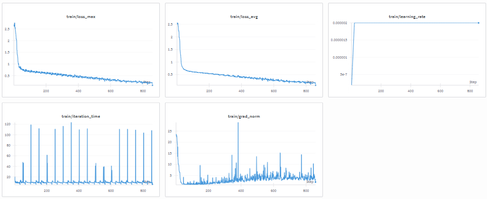

# Post-Training Cosmos-Reason1: Essential Steps Guide

This guide provides the essential steps for post-training Cosmos-Reason1 on your custom datasets or using the official [SFT](https://huggingface.co/datasets/nvidia/Cosmos-Reason1-SFT-Dataset)/[RL](https://huggingface.co/datasets/nvidia/Cosmos-Reason1-RL-Dataset) datasets.

## Table of Contents

- [Prerequisites](#prerequisites)
- [Quick Start](#quick-start)
- [Supervised Fine-Tuning (SFT)](#supervised-fine-tuning-sft)
- [Reinforcement Learning (RL)](#reinforcement-learning-rl)
- [Custom Dataset Setup](#custom-dataset-setup)
- [Evaluation](#evaluation)
- [Common Issues and Tips](#common-issues-and-tips)


## Prerequisites

### Hardware Requirements

**Minimum:**
- 4 GPUs with 80GB memory each (e.g., A100 or H100)
- ~200GB storage for model weights and datasets

**Recommended:**
- 8 GPUs for faster training

### Software Requirements

1. **System Dependencies**
   ```bash
   # Install uv (package manager)
   curl -LsSf https://astral.sh/uv/install.sh | sh
   source $HOME/.local/bin/env

   # Install redis (required for cosmos-rl)
   conda install -c conda-forge redis-server
   # OR
   # sudo apt-get install redis-server  # Ubuntu/Debian
   ```

2. **Hugging Face Setup**
   ```bash
   # Install HF CLI and login
   uv tool install -U "huggingface_hub[cli]"
   hf auth login  # Enter your HF token
   ```

3. **Clone Repository**
   ```bash
   git clone https://github.com/nvidia-cosmos/cosmos-reason1.git
   cd cosmos-reason1
   ```

4. **Environment Variables** (Optional)
   ```bash
   # Set custom cache directory if ~/.cache has limited space
   export HF_HOME=/path/to/large/storage/huggingface
   export COSMOS_CACHE=/path/to/large/storage/cosmos
   ```

### Monitoring Setup (Optional but Recommended)

Configure Weights & Biases for training monitoring:

```bash
uv tool install -U wandb
wandb login  # Enter your API key from https://wandb.ai/authorize
```

## Quick Start

### Example + setup: Full Post-Training with cosmos-rl

Best for production use with official datasets.

```bash
# Navigate to post-training directory
cd examples/post_training

# Install dependencies
just install
source .venv/bin/activate

# Run SFT training (4x A100 80GB)
cosmos-rl --config configs/sft.toml ./tools/dataset/cosmos_sft.py

# Run RL training (4x A100 80GB)
cosmos-rl --config configs/rl.toml tools/dataset/cosmos_grpo.py
```

### Verification

At this point, you should have everything set up - the repo is cloned, dependencies are installed, HF auth is working, and the training tools are ready to go. If you ran into any issues above, double-check the error messages before proceeding.

Now we can move on to the actual customized post-training part.

---

## Problem Statement & Evaluation Strategy

### Defining Your Problem

Before diving into post-training, it's crucial to clearly define the problem you're trying to solve and establish robust evaluation metrics. This will guide your data collection, training approach, and success measurement.

### Evaluation Best Practices

For quantitative assessment of post-training improvements, structure your evaluation as:

**Recommended Evaluation Formats:**
1. **Multiple Choice Questions (MCQ)** - Most robust for automated evaluation
   ```
   Question: What is the primary cause of the accident in this video?
   A) Weather conditions
   B) Vehicle malfunction  
   C) Driver error
   D) Road infrastructure
   ```

2. **Binary Classification** - Clear yes/no decisions
   ```
   Does this video show a collision? [Yes/No]
   Is the driver following traffic rules? [Yes/No]
   ```

3. **Error Correlation Analysis** - Compare model outputs against ground truth
   - Semantic similarity scores
   - BLEU/ROUGE metrics for text generation
   - Custom domain-specific metrics


### Choosing Your Training Approach

**Use SFT (Supervised Fine-Tuning) when:**
- You have labeled question-answer pairs with clear target outputs
- You need to teach domain-specific knowledge or terminology
- You want to standardize response formats
- **Data needed**: 1,000+ pairs minimum (10,000+ recommended)
- **Training time**: 35 minutes to a few hours
- **Example**: 9,273 AV videos with annotations, or 5,000 MCQ pairs achieving >90% accuracy

**Chain-of-Thought (CoT) tip**: Adding CoT reasoning during training can boost accuracy by 5-10%, but increases generation and validation costs due to longer responses.

**Use RL (Reinforcement Learning) when:**
- You need to improve reasoning processes and decision-making
- Tasks have multiple valid solutions
- You have a reward function or human feedback mechanism
- **Data needed**: Fewer samples than SFT (but more compute)
- **Training time**: 4-8 hours
- **Example**: Embodied AI planning, physical reasoning, safety-critical decisions

**Hybrid approach (SFT → RL):**
Most production systems use both. Start with SFT to establish domain knowledge (1-2 hours), then use RL to refine reasoning quality (4-8 hours additional).

---

## Supervised Fine-Tuning (SFT)

   First, create a new directory for your post-training example:

   ```bash
   # Create your custom post-training directory
   mkdir -p examples/post_training_vqa
   cd examples/post_training_vqa
      
   # Copy the base structure from the main post-training example
   cp -r ../post_training/configs ./
   cp -r ../post_training/tools ./
   cp ../post_training/justfile ./
   
   # Install dependencies in your new directory (optional - you can reuse the original venv)
   # just install
   # source .venv/bin/activate
   ```

### Data Preparation

Before starting SFT training, you'll need to prepare your training dataset. SFT typically requires a substantial amount of high-quality data to be effective.

**Data Requirements:**
- **Minimum**: 1,000+ training pairs for basic fine-tuning
- **Recommended**: 10,000+ training pairs for robust performance
- **Optimal**: 50,000+ training pairs for production-quality models
- **Rule of thumb**: More data generally leads to better results

**Directory structure for this example:**
```
/your/dataset/path/
├── videos/
│   ├── video1.camera_front_wide_120fov.mp4
│   ├── video2.camera_front_wide_120fov.mp4
│   └── ...
└── metas/
    ├── video1.label.json
    ├── video2.label.json
    └── ...
```

### Step-by-Step SFT Training

1. **Prepare Your Custom Dataset Loader**

   The default `cosmos_sft.py` loads datasets from HuggingFace. For local custom datasets, you'll need to create a modified dataset loader. Here are the key differences:

   **Default HuggingFace Loader (`cosmos_sft.py`):**
   - Loads data from HuggingFace Hub using `load_dataset()`
   - Expects standardized HF dataset format with conversations
   - Videos stored in HF cache directory structure
   - Data already preprocessed and structured

   **Custom Local Loader (`avha_sft_single_caption.py`):**
   - Loads data from local filesystem directories
   - Scans for video files with specific naming pattern (e.g., `.camera_front_wide_120fov.mp4`)
   - Matches videos with JSON caption files (e.g., `{video_id}.label.json`)
   - Converts JSON annotations to text format for training

   **Key modifications in custom loader:**

   ```python
   # 1. Local file scanning instead of HF dataset loading
   def _load_dataset_entries(self):
       # Scan local directories for videos and captions
       video_files = list(self.videos_dir.glob("*.camera_front_wide_120fov.mp4"))
       
       for video_file in video_files:
           base_id = video_filename[:-len(".camera_front_wide_120fov.mp4")]
           caption_file = self.captions_dir / f"{base_id}.label.json"
           
           # Load caption from JSON
           with open(caption_file, 'r') as f:
               caption_json = json.load(f)
               caption_data = str(caption_json)  # Convert to string
   
   # 2. Custom data structure
   entries.append({
       "video_id": base_id,
       "video_path": str(video_file),
       "caption_data": caption_data  # Full JSON as string
   })
   
   # 3. Simplified conversation format
   conversations = [
       {
           "role": "user",
           "content": [{
               "type": "video",
               "video": entry["video_path"],
               "max_pixels": MAX_PIXELS,
               "fps": FPS,
           }, {
               "type": "text",
               "text": "Describe what you see in this video.",
           }]
       },
       {
           "role": "assistant",
           "content": full_description  # Direct string from JSON
       }
   ]
   ```

2. **Configure Training Parameters**

   Edit `examples/post_training_vqa/config/avha_sft.toml` to customize for your dataset. Here are the key changes from the default `sft.toml`:

   **Key configuration differences:**

   | Parameter | Default (HF Dataset) | Custom (Local Dataset) | Why Change? |
   |-----------|---------------------|------------------------|-------------|
   | **Dataset** |
   | `dataset.name` | `"nvidia/Cosmos-Reason1-SFT-Dataset"` | `"/path/to/your/local/dataset"` | Point to local filesystem |
   | `dataset.subset` | `"robovqa"` | *removed* | Not needed for local data |
   | `dataset.split` | `"understanding"` | *removed* | Not needed for local data |
   | **Training** |
   | `epoch` | `1` | `50` | More epochs for smaller custom datasets |
   | `output_dir` | `"./outputs/sft"` | `"./outputs/avha_sft_vqa_standard"` | Custom output naming |
   | **Checkpointing** |
   | `save_freq` | `100` | `50` | Save more frequently for long training |
   | `max_keep` | `2` | `4` | Keep more checkpoints for comparison |
   | **Logging** |
   | `project_name` | `"cosmos_reason1"` | `"cosmos_reason1_vqa"` | Custom W&B project name |
   | `experiment_name` | `"post_training/sft"` | `"post_training/avha_sft_vqa_standard"` | Descriptive experiment name |

   **Example custom configuration:**

   ```toml
   [train]
   epoch = 50                                    # Train for more epochs with smaller dataset
   output_dir = "./outputs/avha_sft_vqa_standard"
   train_batch_per_replica = 32                  # Batch size per GPU
   
   [train.train_policy.dataset]
   name = "/project/cosmos/jingyij/dataset/av_human_annotated/v0_1/train"  # Local dataset path
   
   [train.ckpt]
   save_freq = 50      # Save checkpoint every 50 steps
   max_keep = 4        # Keep last 4 checkpoints
   
   [policy.parallelism]
   dp_shard_size = 8   # Number of GPUs (4 or 8)
   
   [logging]
   project_name = "cosmos_reason1_vqa"
   experiment_name = "post_training/avha_sft_vqa_standard"
   ```

   **Important parameters to adjust:**
   - `epoch`: Increase for smaller datasets (10-50), decrease for large datasets (1-3)
   - `dp_shard_size`: Must match your available GPU count
   - `train_batch_per_replica`: Adjust based on GPU memory (reduce if OOM)
   - `dataset.name`: Must point to your local dataset directory

   For a complete reference of all available configuration parameters, see the [Configuration Guide](https://nvidia-cosmos.github.io/cosmos-rl/quickstart/configuration.html).


3. **Run Training**

   Launch training with your custom dataset loader and configuration:

   ```bash
   cd examples/post_training_vqa
   source .venv/bin/activate  # Or reuse: source ../post_training/.venv/bin/activate
   
   # Run SFT training with custom local dataset
   cosmos-rl --config config/avha_sft.toml ./tools/dataset/avha_sft_single_caption.py
   ```

   **Command breakdown:**
   - `--config config/avha_sft.toml`: Your custom configuration file
   - `./tools/dataset/avha_sft_single_caption.py`: Your custom dataset loader for local files

4. **Monitor Progress**

   - **Console**: Watch for loss metrics and training progress
   - **Weights & Biases**: Check the URL printed in logs for detailed metrics and visualizations
     ```
     wandb: 🚀 View run at https://wandb.ai/your-name/cosmos_reason1_vqa/runs/...
     ```
     
     

5. **Locate Checkpoint**

   After training completes, you'll see the checkpoint location in the logs:

   ```log
   [rank0]:Exported safetensors to ./outputs/avha_sft_vqa_standard/20250516061336/safetensors/final
   ```

   **Verify your checkpoint:**

   ```bash
   # List all checkpoints (from examples/post_training_vqa directory)
   ls -lh outputs/avha_sft_vqa_standard/*/safetensors/
   
   # Check the final checkpoint structure
   ls outputs/avha_sft_vqa_standard/20250516061336/safetensors/final/
   # Should contain: config.json, model.safetensors.index.json, model-*.safetensors
   ```

   **Use your checkpoint:**

   ```bash
   # For inference
   export CHECKPOINT_PATH="./outputs/avha_sft_vqa_standard/20250516061336/safetensors/final"
   
   # Test with inference script (from repo root)
   uv run scripts/inference_sample.py --model_path $CHECKPOINT_PATH --video assets/sample.mp4
   
   # For further RL training, update your rl.toml:
   # model_name_or_path = "./outputs/avha_sft_vqa_standard/20250516061336/safetensors/final"
   ```

   The checkpoint is now ready for inference, evaluation, or further RL training.

### SFT Best Practices

- **Start small**: Test with a subset of data first (`train[:100]`)
- **Learning rate**: Default is usually good, but try 1e-6 to 5e-6 if unstable
- **Gradient clipping**: Keep at 1.0 to prevent exploding gradients
- **Checkpoint frequency**: Save every 1000 steps for long training runs

## Reinforcement Learning (RL)

RL training improves reasoning processes and decision-making through reward-based learning using GRPO (Group Relative Policy Optimization). It's most effective when applied after SFT to refine reasoning quality.

**When to use RL:**
- After SFT training to improve reasoning chains
- When you have a reward function or quality evaluation metric
- For tasks requiring multi-step reasoning or decision-making
- To optimize beyond simple supervised examples

### Step-by-Step RL Training

1. **Start from SFT Checkpoint**

   RL training should begin with an SFT-trained checkpoint for best results:

   ```bash
   # Identify your SFT checkpoint
   export SFT_CHECKPOINT="./outputs/avha_sft_vqa_standard/20250516061336/safetensors/final"
   ls -lh $SFT_CHECKPOINT  # Verify it exists
   ```

2. **Configure Training Parameters**

   Edit `examples/post_training/configs/rl.toml` and update the model path:

   ```toml
   [policy]
   model_name_or_path = "./outputs/avha_sft_vqa_standard/20250516061336/safetensors/final"  # Your SFT checkpoint
   model_max_length = 4096
   model_gradient_checkpointing = true
   
   [train]
   epoch = 1
   output_dir = "./outputs/rl"
   
   [rollout.parallelism]
   tp_size = 2  # Tensor parallel size for rollout inference
   
   [policy.parallelism]
   dp_shard_size = 8  # Number of GPUs (must match available GPUs)
   
   [train.train_policy]
   rollout_batch_size = 32
   
   [grpo]
   num_samples_per_prompt = 4  # Generate 4 candidate responses per prompt
   ```

   **Key Parameters:**
   - `model_name_or_path`: Path to your SFT checkpoint (start here!)
   - `tp_size`: Tensor parallelism for rollout inference (2 or 4)
   - `dp_shard_size`: Data parallelism for policy training (4 or 8)
   - `num_samples_per_prompt`: Candidate responses per prompt (2-8)
   - `rollout_batch_size`: Batch size for generating responses

   For a complete reference, see the [RL Configuration Guide](https://nvidia-cosmos.github.io/cosmos-rl/quickstart/configuration.html).

3. **Run RL Training**

   ```bash
   cd examples/post_training
   source .venv/bin/activate
   
   # Launch RL training with GRPO
   cosmos-rl --config configs/rl.toml tools/dataset/cosmos_grpo.py
   ```

4. **Monitor Progress**

   RL training requires monitoring several key metrics:

   - **Console**: Watch training progress and metrics
   - **Weights & Biases**: Track detailed metrics
     ```
     wandb: 🚀 View run at https://wandb.ai/your-name/cosmos_reason1/runs/...
     ```

   **Key metrics to watch:**
   - **Reward**: Should increase over training iterations
   - **KL divergence**: Should stay bounded (typically < 0.1)
     - Too high → Model deviating too far from SFT base
     - Adjust `kl_penalty` if needed
   - **Response quality**: Review sample generations in W&B
   - **Loss convergence**: Policy loss should decrease steadily

5. **Locate Checkpoint**

   After RL training completes:

   ```log
   [rank0]:Exported safetensors to ./outputs/rl/20250517123456/safetensors/final
   ```

   **Verify your RL checkpoint:**

   ```bash
   # List RL checkpoints
   ls -lh outputs/rl/*/safetensors/
   
   # Check checkpoint structure
   ls outputs/rl/20250517123456/safetensors/final/
   ```

   **Use your RL checkpoint:**

   ```bash
   # For inference
   export RL_CHECKPOINT="./outputs/rl/20250517123456/safetensors/final"
   
   # Test with inference script
   uv run scripts/inference_sample.py --model_path $RL_CHECKPOINT --video assets/sample.mp4
   ```

### RL Best Practices

- **Start from SFT checkpoint**: RL works best after SFT
- **KL penalty**: Prevents model from deviating too far (default: 0.01)
- **Reward function**: Carefully design task-specific rewards
- **Balanced reward distribution**: Ensure training data has balanced samples across the reward model's output range.


## Cookbook recipes in CR post-trianing: 

| **Description** | **Link** |
|-----------------|----------|
| Physical plausibility check for video quality assessment | [Video Rewards](recipes/post_training/reason1/physical-plausibility-check/post_training.md) |
| Spatial AI understanding for warehouse environments | [Spatial AI Warehouse](recipes/post_training/reason1/spatial-ai-warehouse/post_training.md) |
| Intelligent transportation scene understanding and analysis | [Intelligent Transportation](recipes/post_training/reason1/intelligent-transportation/post_training.md) |
| AV video captioning and visual question answering for autonomous vehicles | [AV Video Caption VQA](recipes/post_training/reason1/av_video_caption_vqa/post_training.md) |
