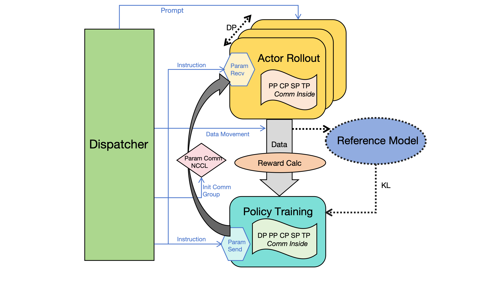

    

### [NVIDIA Cosmos](https://www.nvidia.com/en-us/ai/cosmos/) | [Paper](https://arxiv.org/abs/2503.15558) | [Website](https://research.nvidia.com/labs/dir/cosmos-reason1/) | [HuggingFace](https://huggingface.co/collections/nvidia/cosmos-reason1-67c9e926206426008f1da1b7)

Cosmos-Reason1 is a suite of models, ontologies, and benchmarks that we develop with the goal of enabling multimodal LLMs to generate physically grounded responses. We release one multimodal LLMs: Cosmos-Reason1-7B post-trained with Physical AI SFT, and Physical AI reinforcement learning. We define ontologies for physical common sense and embodied reasoning, and also build benchmarks to evaluate Physical AI reasoning capabilities of multimodal LLMs.

## Model

* [Cosmos-Reason1-7B](https://huggingface.co/nvidia/Cosmos-Reason1-7B)

### Example Model Behavior

<video src="https://github.com/user-attachments/assets/bccdb462-bb92-42ed-a85c-1bc5bc473395">
  Your browser does not support the video tag.
</video>

### Getting Started
Please check our [User Guide](docs/UserGuide.md).

## System Architecture
Cosmos-Reason1 provides toolchain to enable large scale SFT and RL training workload with following features:
1. **HuggingFace Integration**
    - Qwen-2.5
    - Qwen-2.5-VL
    - Qwen-3
    - Qwen-3-MoE

2. **Parallelism**
    - Tensor Parallelism
    - Sequence Parallelism
    - Context Parallelism
    - FSDP Parallelism
    - Pipeline Parallelism
3. **Fully asynchronous (replicas specialization)**
    - Policy (Consumer): Replicas of training instances
    - Rollout (Producer): Replicas of generation engines
    - Low-precision training (FP8) and rollout (FP8 & FP4) spport
4. **Single-Controller Architecture**
    - Efficient messaging system (e.g. `weight-sync`, `rollout`, `evaluate`) to coordinate policy and rollout replicas
    - Dynamic NCCL Process Groups for on the fly replicas registration/un-registration to enable fault-tolerant and elastic large scale RL training
    - Dynamic hyper-parameters adjustment

## License and Contact

This project will download and install additional third-party open source software projects. Review the license terms of these open source projects before use.

NVIDIA Cosmos source code is released under the [Apache 2 License](https://www.apache.org/licenses/LICENSE-2.0).

NVIDIA Cosmos models are released under the [NVIDIA Open Model License](https://www.nvidia.com/en-us/agreements/enterprise-software/nvidia-open-model-license). For a custom license, please contact [cosmos-license@nvidia.com](mailto:cosmos-license@nvidia.com).
