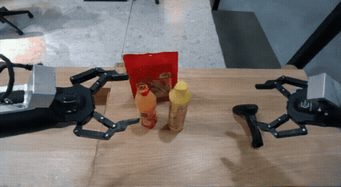

<p align="center">
    
</p>

### [Paper](https://arxiv.org/abs/2503.15558) | [Website](https://research.nvidia.com/labs/dir/cosmos-reason1/) | [HuggingFace](https://huggingface.co/collections/nvidia/cosmos-reason1-67c9e926206426008f1da1b7)

Cosmos-Reason1 is a suite of models, ontologies, and benchmarks that we develop with the goal of enabling multimodal LLMs to generate physically grounded responses. We release one multimodal LLMs: Cosmos-Reason1-7B post-trained with Physical AI SFT, and Physical AI reinforcement learning. We define ontologies for physical common sense and embodied reasoning, and also build benchmarks to evaluate Physical AI reasoning capabilities of multimodal LLMs.

## News
* 2025-06-11: We enhance the model’s capability on judging the physical plausibility of a video. See [this tutorial](https://github.com/nvidia-cosmos/cosmos-reason1/blob/main/examples/video_critic.md) for details.
* 2025-05-17: We release model weights and training data under [Hugging Face](https://huggingface.co/collections/nvidia/cosmos-reason1-67c9e926206426008f1da1b7).

## Model

* [Cosmos-Reason1-7B](https://huggingface.co/nvidia/Cosmos-Reason1-7B)

## Getting Started

### Install

```sh
# Install uv/just
curl -LsSf https://astral.sh/uv/install.sh | sh
source $HOME/.local/bin/env
uv tool install rust-just

# Clone the repository
git clone https://github.com/nvidia-cosmos/cosmos-reason1.git
cd cosmos-reason1
```

Install the package using your preferred environment:

1. venv

```sh
just install
source .venv/bin/activate
```

2. conda

```sh
just conda-env
conda activate cosmos-reason1
```

### Inference
> **NOTE:** We suggest using `fps=4` for the input video and `max_tokens=4096` to avoid truncated response.
```python
from transformers import AutoProcessor
from vllm import LLM, SamplingParams
from qwen_vl_utils import process_vision_info

# You can also replace the MODEL_PATH by a safetensors folder path mentioned above
MODEL_PATH = "nvidia/Cosmos-Reason1-7B"

llm = LLM(
    model=MODEL_PATH,
    limit_mm_per_prompt={"image": 10, "video": 10},
)

sampling_params = SamplingParams(
    temperature=0.6,
    top_p=0.95,
    repetition_penalty=1.05,
    max_tokens=4096,
)

video_messages = [
    {"role": "system", "content": "You are a helpful assistant. Answer the question in the following format: <think>\nyour reasoning\n</think>\n\n<answer>\nyour answer\n</answer>."},
    {"role": "user", "content": [
            {"type": "text", "text": (
                    "Is it safe to turn right?"
                )
            },
            {
                "type": "video", 
                "video": "assets/sample.mp4",
                "fps": 4,
            }
        ]
    },
]

# Here we use video messages as a demonstration
messages = video_messages

processor = AutoProcessor.from_pretrained(MODEL_PATH)
prompt = processor.apply_chat_template(
    messages,
    tokenize=False,
    add_generation_prompt=True,
)
image_inputs, video_inputs, video_kwargs = process_vision_info(messages, return_video_kwargs=True)

mm_data = {}
if image_inputs is not None:
    mm_data["image"] = image_inputs
if video_inputs is not None:
    mm_data["video"] = video_inputs

llm_inputs = {
    "prompt": prompt,
    "multi_modal_data": mm_data,

    # FPS will be returned in video_kwargs
    "mm_processor_kwargs": video_kwargs,
}

outputs = llm.generate([llm_inputs], sampling_params=sampling_params)
generated_text = outputs[0].outputs[0].text

print(generated_text)
```

<table>
  <tr>
    <td>
      <p>User prompt: Is it safe to turn right?</p>
      <br/>
    </td>
    <td style="vertical-align: top; padding-left: 20px;">
      <!-- Text on the right -->
      <p>Assistant response: </p>
      <p>
&lt;think&gt;
Okay, let's see. The user is asking if it's safe to turn right based on the video provided. First, I need to ...
The key points here are the parked vehicles. There are cars parked on both sides of the road, ...
&lt;/think&gt;

&lt;answer&gt;
Based on the video, turning right may not be entirely safe due to the following factors: ...
&lt;/answer&gt;
      </p>
    </td>
  </tr>
  <tr>
    <td>
      <p>User prompt: Analyze the video for any artifacts or anomalies.</p>
      <br/>
    </td>
    <td style="vertical-align: top; padding-left: 20px;">
      <!-- Text on the right -->
      <p>Assistant response:</p>
      <p>
&lt;component name="Orange Bottle Interaction"&gt;<br>
&lt;analysis&gt;
The left robot arm approaches the orange bottle and makes contact with it. However, instead of grasping the bottle firmly, the gripper wraps around it in an awkward manner, failing to secure a proper hold ... suggesting a glitch in the interaction physics. &lt;/analysis&gt;<br>
&lt;/component&gt;<br>
...
      </p>
    </td>
  </tr>
</table>

### Tutorial
[Using Cosmos-Reason1 as Video Critic for Rejection Sampling](examples/video_critic.md).

### SFT and RL Training
The [nvidia-cosmos/cosmos-rl](https://github.com/nvidia-cosmos/cosmos-rl)  repository is an async post-training framework specialized for Supervised Fine-Tuning (SFT) and Reinforcement Learning with Human Feedback (RLHF). It prioritizes performance, scalability, and fault tolerance.

For detailed instructions on running SFT and PPO training, please refer to our [User Guide](docs/UserGuide.md).

## License and Contact

This project will download and install additional third-party open source software projects. Review the license terms of these open source projects before use.

NVIDIA Cosmos source code is released under the [Apache 2 License](https://www.apache.org/licenses/LICENSE-2.0).

NVIDIA Cosmos models are released under the [NVIDIA Open Model License](https://www.nvidia.com/en-us/agreements/enterprise-software/nvidia-open-model-license). For a custom license, please contact [cosmos-license@nvidia.com](mailto:cosmos-license@nvidia.com).
