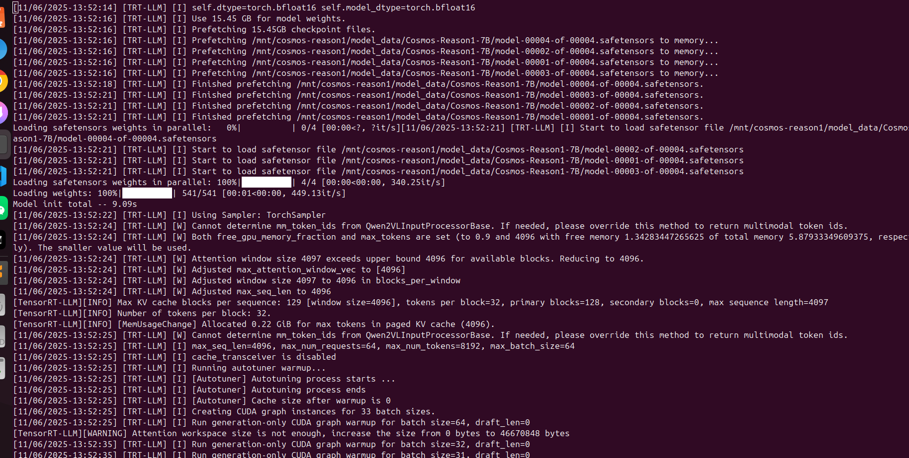
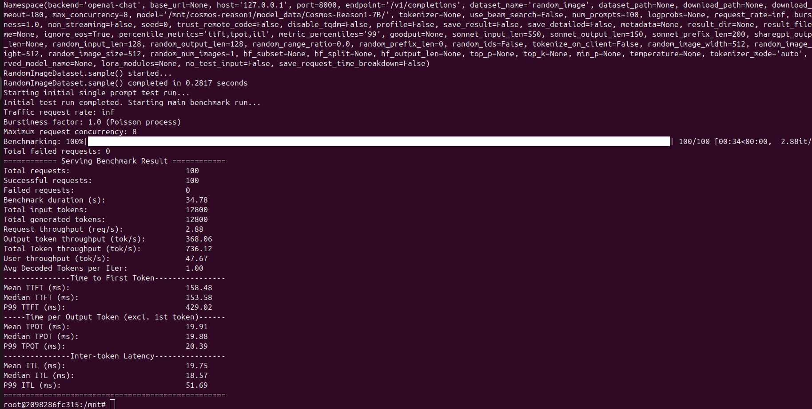
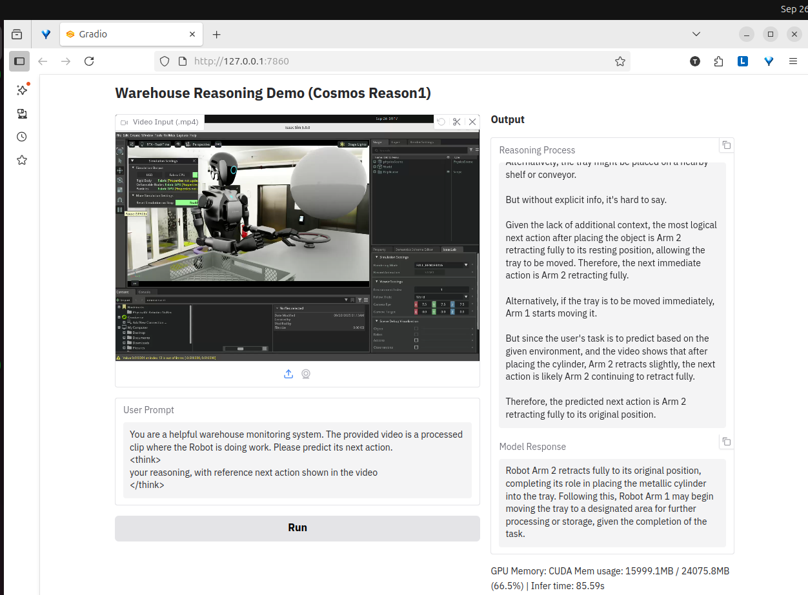
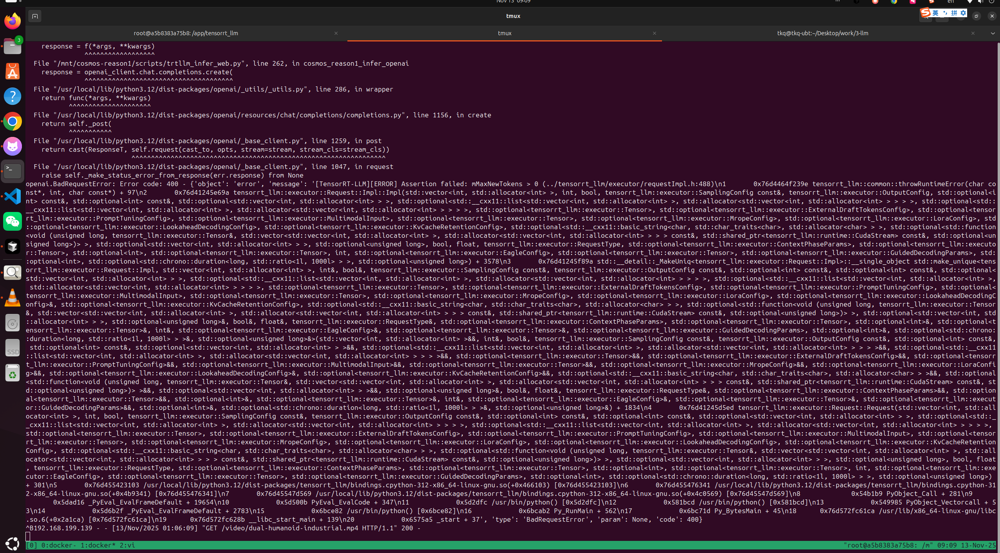
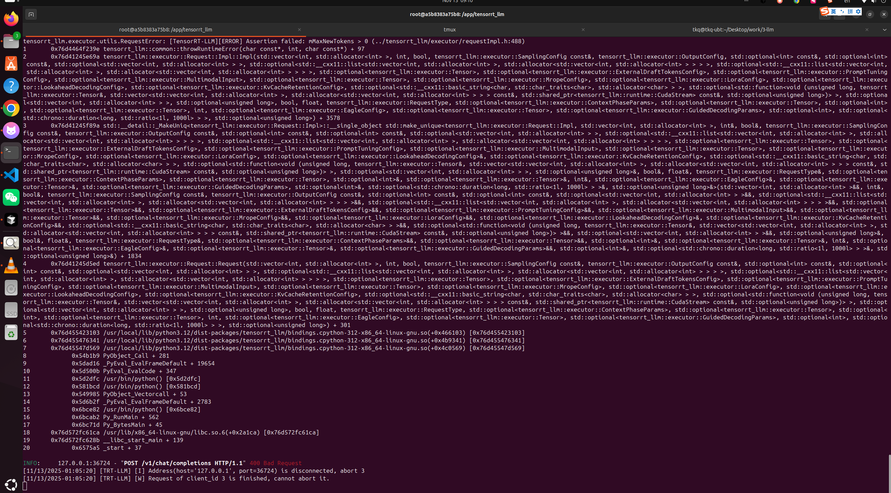

# TensorRT-LLM Acceleration Example

This example demonstrates how to run Cosmos-Reason1 with TensorRT-LLM acceleration using a web interface for video inference.

## Prerequisites

- Docker with GPU support
- NVIDIA GPU with CUDA support
- TensorRT-LLM Docker image: `nvcr.io/nvidia/tensorrt-llm/release:1.2.0rc1`

## Quick Start

### 1. Start Docker Container

Run the Docker container with GPU support and port mappings:

```bash
docker run --rm -it --ipc host --gpus all \
  --ulimit memlock=-1 --ulimit stack=67108864 \
  -p 8000:8000 -p 8001:8001 -p 8002:8002 -p 8003:8003 \
  -v $PWD:/mnt -v ~/Desktop:/Desktop \
  nvcr.io/nvidia/tensorrt-llm/release:1.2.0rc1
```

### 2. Start TensorRT-LLM Server

Inside the container, set the model path and start the server:

```bash
export model_path="/mnt/cosmos-reason1/model_data/Cosmos-Reason1-7B/"

trtllm-serve ${model_path} \
    --max_batch_size 64 \
    --max_num_tokens 8192 \
    --max_seq_len 4096 \
    --kv_cache_free_gpu_memory_fraction 0.9 \
    --tp_size 1 \
    --ep_size 1 \
    --trust_remote_code \
    --host 0.0.0.0
```

> **Note:** You can adjust `batch_size`, `seq_len`, `kv_cache` and `num_tokens` according to your needs and workstation GPU memory.

The server will be available at `http://{YOUR_IP}:8000`.



You can try the TensorRT-LLM benchmark:

```bash
python -m tensorrt_llm.serve.scripts.benchmark_serving \
    --model ${model_path} \
    --backend openai-chat \
    --dataset-name "random_image" \
    --random-input-len 128 \
    --random-output-len 128 \
    --random-image-width 512 \
    --random-image-height 512 \
    --random-num-images 1 \
    --num-prompts 100 \
    --max-concurrency 8 \
    --ignore-eos
```



### 3. Run Web Interface

In a separate terminal (or after starting the server in the background), run the web interface:

```bash
python trtllm_infer_web.py
```

The web interface will be available at `http://{YOUR_IP}:8001`. You can upload videos and test the model through the Gradio interface.

### Sample prompt Format and Expected Output

A sample prompt format for extracting reasoning and answer:

```
You are a helpful warehouse monitoring system. The provided video is a processed clip where the Robot is doing work. Please predict its next action.
<think> 
your reasoning, with reference next action shown in the video
</think>
<answer>
your answer, with reference next action shown in the video
</answer>
```

Ideally, a successful request should look like below:



## Port Usage

- **8000**: TensorRT-LLM API server
- **8001**: Gradio web interface
- **8002**: Video file server
- **8003**: Reserved for future use

## Features

- Video upload and inference
- Real-time GPU memory monitoring
- Reasoning process visualization
- Model response display

## Known Issues

**2025/11/13**

There is a compatibility issue for video support in Cosmos-Reason1 TensorRT-LLM service:

**Client request log:**


**TensorRT-LLM backend log:**
