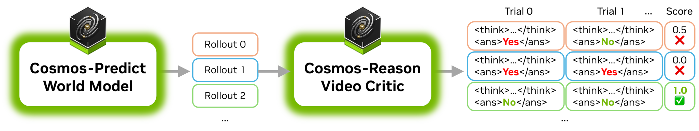

# Using Cosmos-Reason1 as Video Critic for Rejection Sampling

<p align="center">
  
</p>


Cosmos-Reason1 is capable of evaluating whether a video adhere to fundamental physical laws such as Gravity, Object Permanency, Collision dynamics, and Cause-and-effect relationships.

When paired with a world model such as [Cosmos-Predict2](https://github.com/nvidia-cosmos/cosmos-predict2/), it enables best-of-N sampling by generating multiple video candidates and selecting the most physically accurate ones, thereby improving generation quality.


## Step 1 - Generating Multiple Videos

Multiple different videos are generated 
<table>
  <tr>
    <td align="center">
      <strong>Generation 0</strong><br>
      
      <!--  -->
    </td>
    <td align="center">
      <strong>Generation 1</strong><br>
      
      <!--  -->
    </td>
  </tr>
  <tr>
    <td align="center">
      <strong>Generation 2</strong><br>
      
    </td>
    <td align="center">
      <strong>Generation 3</strong><br>
      
    </td>
  </tr>
</table>

## Step 2 - Evaluating the Physical Accuracy using Cosmos-Reason1
Cosmos-Reason1 is instructed to analyze each video element-by-element, and organize the analysis process in a structured format for easy parsing. 

Click on the links to see the full thinking traces.

## Step 3 - Scoring the Videos
To obtain a fine-grained assessment of the video, the video critic can be applied repeatedly, and the quality score is defined as the number of artifact-free evaluations over the total number of evaluations. Only the video with the highest score is retained as the final, high-quality output.


## Prompting Recommendations
### System prompt

```
You are a helpful video analyzer. The goal is to identify artifacts and anomalies in the video.
Analyze the video carefully and answer the question according to the following template:

<think>
<overview>
[Brief description of the video.]
</overview>

<component name="Component 1 Name">
<analysis>
[Analysis or reasoning about this component.]
</analysis>
<anomaly>Yes | No</anomaly>
</component>

<component name="Component 2 Name">
<analysis>
[Analysis or reasoning about this component.]
</analysis>
<anomaly>Yes | No</anomaly>
</component>

<!-- Add more components as needed -->
</think>

<answer>
[Whether the video contains anomalies or artifacts. Answer "Yes" or "No".]
</answer>
```

### User prompt
```
Analyze the video for any artifacts or anomalies.
```

