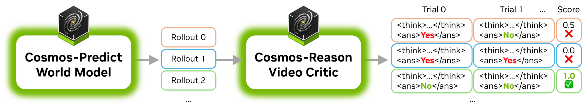
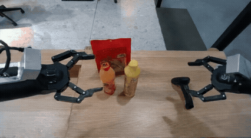

# Using Cosmos-Reason1 as Video Critic for Rejection Sampling

<p align="center">
  
</p>


Cosmos-Reason1 is capable of evaluating whether a video adhere to fundamental physical laws such as Gravity, Object Permanency, Collision dynamics, and Cause-and-effect relationships.

When paired with a world model such as [Cosmos-Predict2](https://github.com/nvidia-cosmos/cosmos-predict2/), it enables best-of-N sampling by generating multiple video candidates and selecting the most physically accurate ones, thereby improving generation quality.


## Step 1 - Generating Multiple Rollouts

Using the same input, the world model generates multiple video rollouts. Among these, some exhibit greater physical plausibility than others.

<table>
  <tr>
    <td align="center">
      <strong>Generation 0</strong><br>
      
    </td>
    <td align="center">
      <strong>Generation 1</strong><br>
      
    </td>
  </tr>
  <tr>
    <td align="center">
      <strong>Generation 2</strong><br>
      
    </td>
    <td align="center">
      <strong>Generation 3</strong><br>
      
    </td>
  </tr>
</table>

 The videos above are generated by [Cosmos-Predict2-2B-Video2World](https://huggingface.co/nvidia/Cosmos-Predict2-2B-Video2World).

## Step 2 - Evaluating the Physical Accuracy using Cosmos-Reason1
Cosmos-Reason1 is tasked to analyze each video element-by-element, and organize the analysis process in a structured format for easy parsing. To obtain a fine-grained assessment, each video undergoes multiple evaluation trials (4 in this example). The quality score is calculated as the ratio of artifact-free evaluations to the total number of evaluations. The video with the highest score is retained as the final high-quality output.

| Video | Evaluation and Example Output |
|-------|-------------------|
|  | Score: 0.0 <br><br> [Raw Output](assets/generation_0_raw_output.txt) <br><br> [Formatted Output](assets/generation_0_formatted.md) |
|  | **Score: 0.75 (Best)** <br><br> [Raw Output](assets/generation_1_raw_output.txt) <br><br> [Formatted Output](assets/generation_1_formatted.md) |
|  | Score: 0.25 <br><br> [Raw Output](assets/generation_2_raw_output.txt) <br><br> [Formatted Output](assets/generation_2_formatted.md) |
|  | Score: 0.5 <br><br> [Raw Output](assets/generation_3_raw_output.txt) <br><br> [Formatted Output](assets/generation_3_formatted.md) |

We also provide an [example script](video_critic.py) that demonstrates how to parse the Reason1 output and reformat it into an html report.

```bash
./examples/video_critic/video_critic.py --video_path assets/sample.mp4 --num_trials 4
# The resulting html file will be saved to assets/sample.html
```

## Prompting Recommendations

Below are the prompts used in this example.

### System prompt

```
You are a helpful video analyzer. The goal is to identify artifacts and anomalies in the video.
Analyze the video carefully and answer the question according to the following template:

<think>
<overview>
[Brief description of the video.]
</overview>

<component name="Component 1 Name">
<analysis>
[Analysis or reasoning about this component.]
</analysis>
<anomaly>Yes | No</anomaly>
</component>

<component name="Component 2 Name">
<analysis>
[Analysis or reasoning about this component.]
</analysis>
<anomaly>Yes | No</anomaly>
</component>

<!-- Add more components as needed -->
</think>

<answer>
[Whether the video contains anomalies or artifacts. Answer "Yes" or "No".]
</answer>
```

### User prompt
```
Analyze the video for any artifacts or anomalies.
```

